# coss.com Design System

> open source, open heart, open mind.

This is the design system for **coss.com** — *"the everything but AI company."* coss.com is the holding company of [cal.com](https://cal.com), the pioneers of open source scheduling, and is building the **coss stack**: a one-line `npm install @coss` package bundling email, SMS, calendar, scheduling, video, payments and notifications APIs behind a single environment key. Its philosophy is **commercial open source software (COSS)** — a sustainable model for the open source that underpins all modern software.

The visual system is **coss.com/ui** (formerly Origin UI), the official Cal.com Design System: a collection of accessible, composable React components built on [Base UI](https://base-ui.com) and styled with Tailwind CSS. It is monochrome-forward, quiet, and engineered — built "for developers and AI."

This project is a faithful port of that system into framework-free CSS + React so any agent can design on-brand coss.com artifacts.

---

## Preview

### Marketing site & component docs

| coss.com homepage | coss ui docs |
|---|---|
| 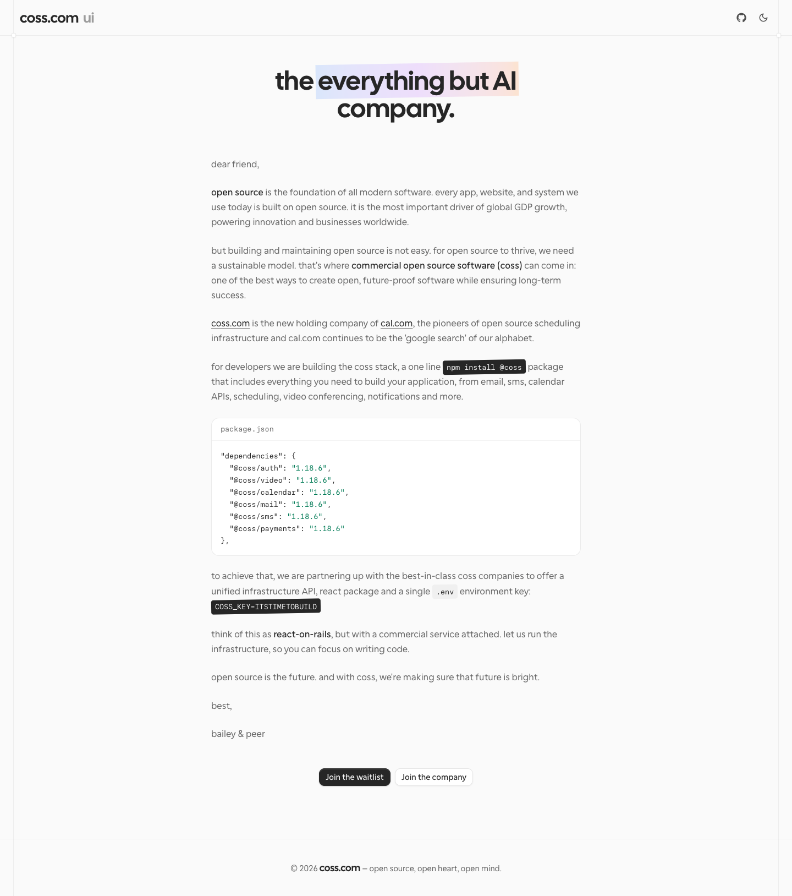 | 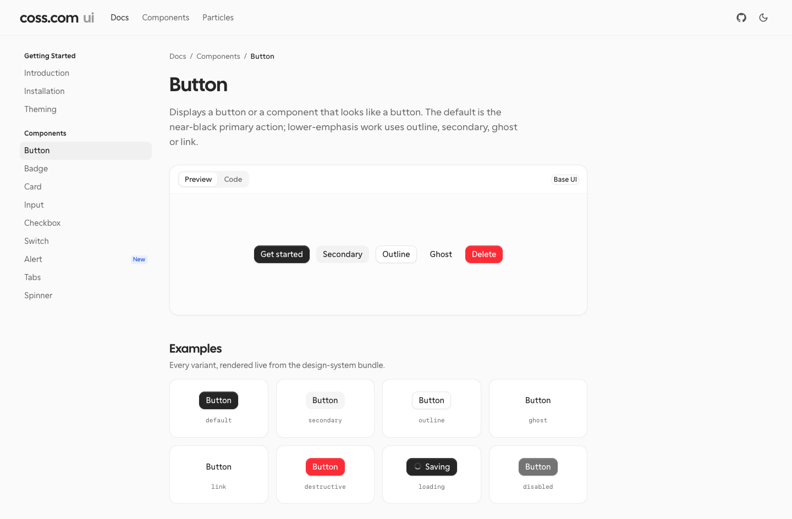 |

### Foundations

| Neutral color ramp | Semantic colors | Typography | Spacing | Elevation |
|---|---|---|---|---|
| 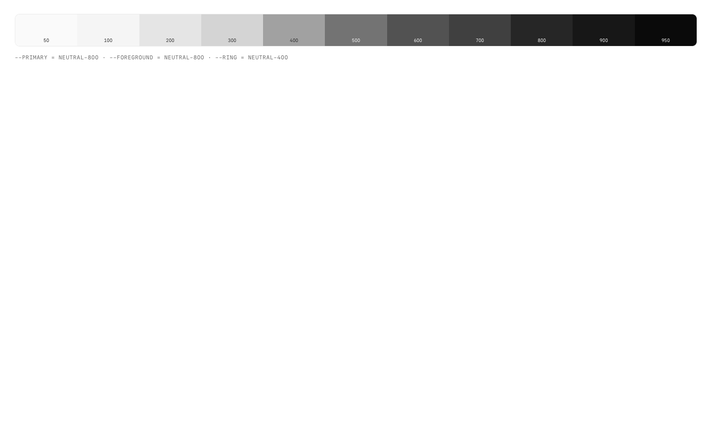 | 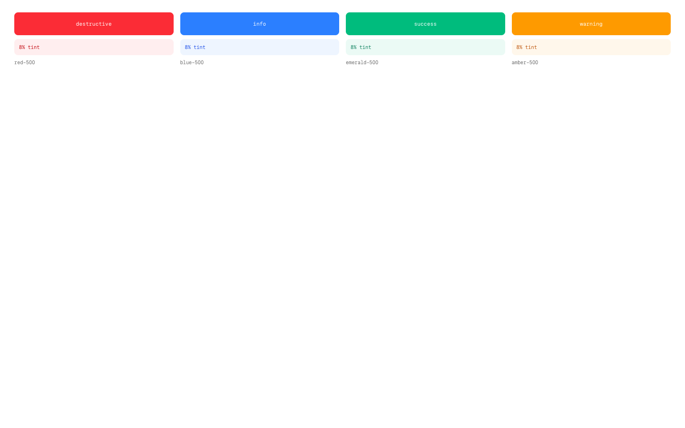 | 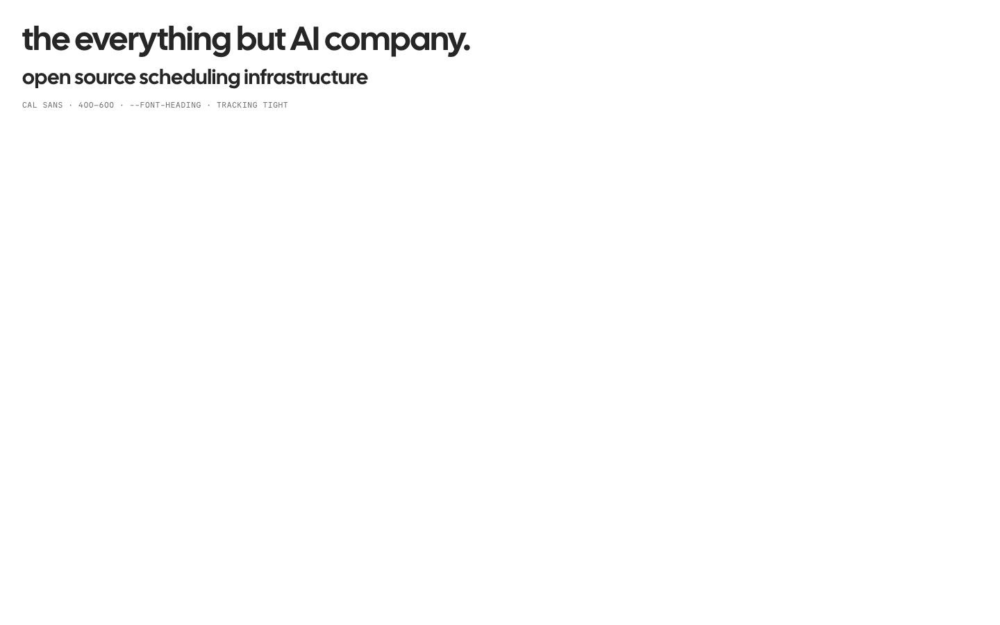 |  | 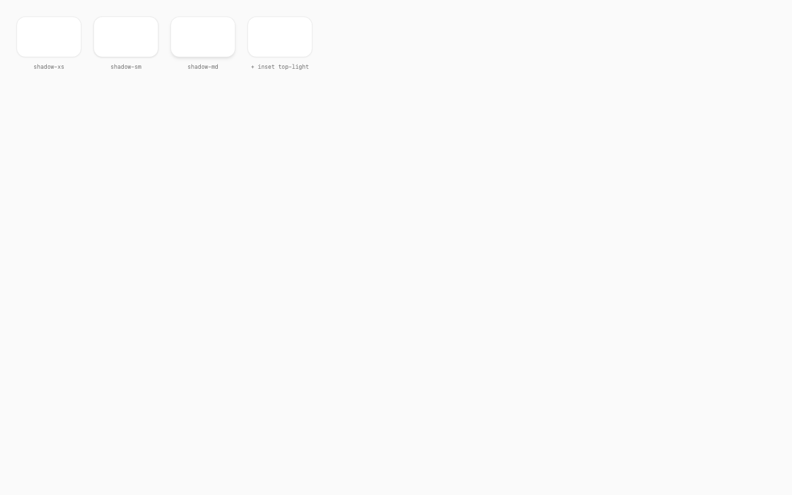 |

### Components

| Buttons & badges | Forms | Data display | Feedback | Navigation |
|---|---|---|---|---|
| 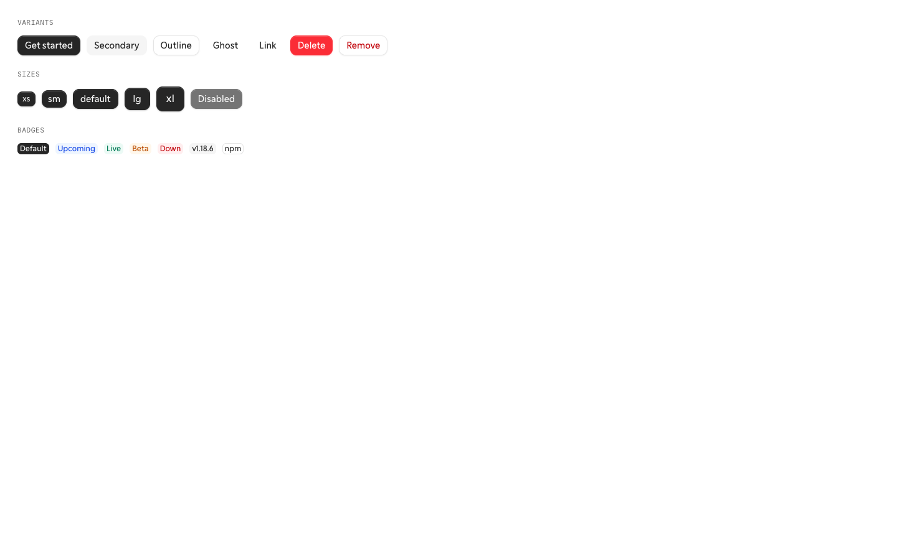 | 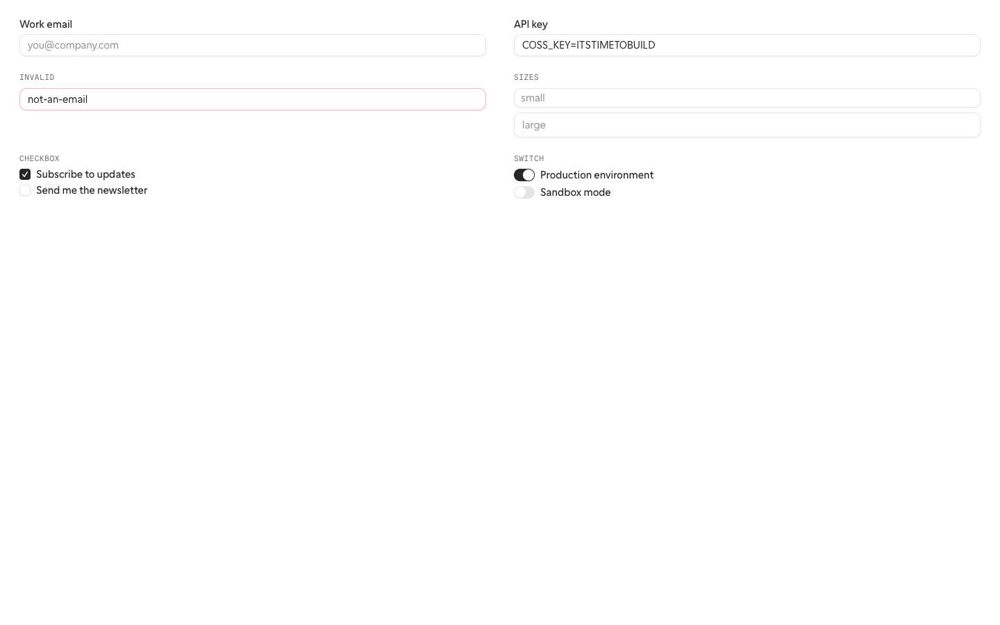 | 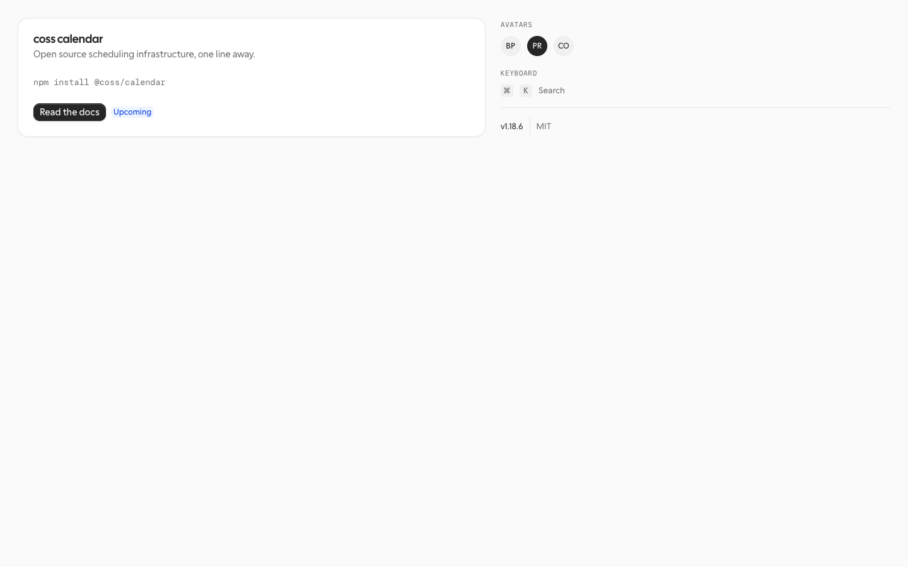 | 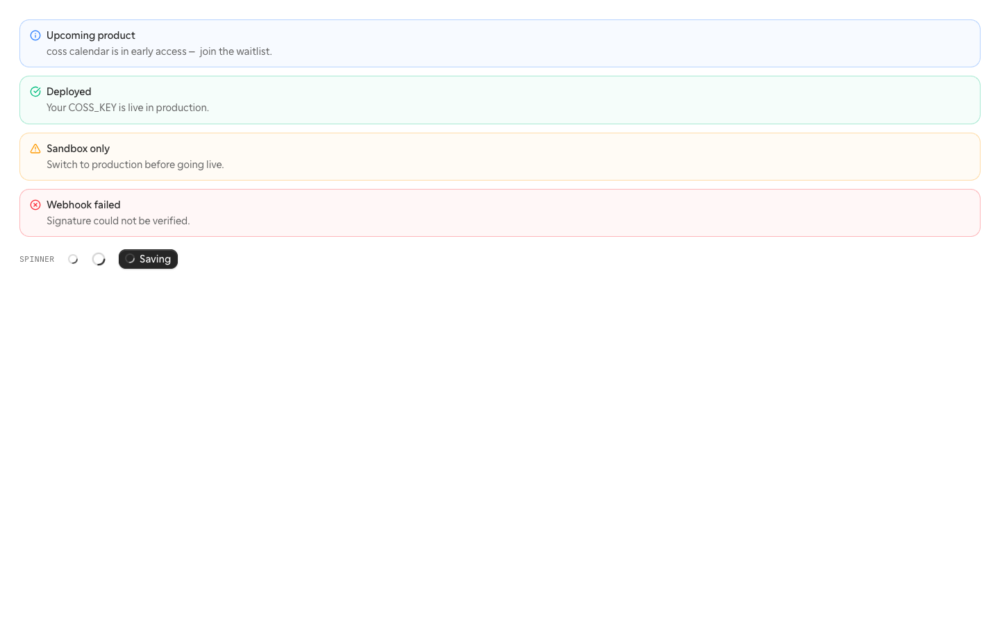 | 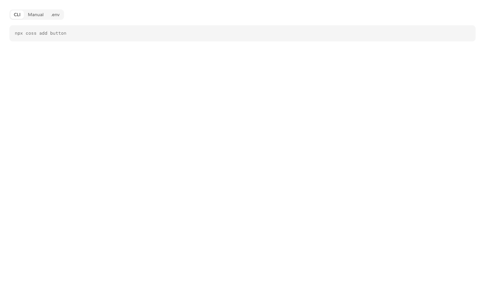 |

---

## What you should do — IMPORTANT

**Find the primary design file under `project/` and read it top to bottom.** Then **follow its imports**: open every file it pulls in (shared components, CSS, scripts) so you understand how the pieces fit together before you start implementing.

**If anything is ambiguous, ask the user to confirm before you start implementing.** It's much cheaper to clarify scope up front than to build the wrong thing.

## About the design files

The design medium is **HTML/CSS/JS** — these are prototypes, not production code. Your job is to **recreate them pixel-perfectly** in whatever technology makes sense for the target codebase (React, Vue, native, whatever fits). Match the visual output; don't copy the prototype's internal structure unless it happens to fit.

Everything you need — dimensions, colors, layout rules — is spelled out in the source. Read the HTML and CSS directly.

## Bundle contents

- `README.md` — this file
- `project/` — the `coss.com Design System` project files (HTML prototypes, assets, components)
  - `styles.css` — global entry point. Link this one file; it `@import`s everything below.
  - `tokens/` — palette, semantic colors (light + dark), typography, spacing/radius/elevation, fonts.
  - `components/` — React primitives (Button, Badge, Card, Input, Label, Checkbox, Switch, Avatar, Kbd, Separator, Alert, Spinner, Tabs).
  - `guidelines/` — visual specimen cards.
  - `ui_kits/` — full-screen recreations (marketing site, component docs).
  - `assets/fonts/` — Cal Sans, Cal Sans UI, Paper Mono (woff2).

## Sources

Everything here was derived from the official monorepo. Explore it for deeper fidelity:

- **GitHub — [github.com/cosscom/coss](https://github.com/cosscom/coss)** — the public monorepo. Key paths read to build this system:
  - `packages/ui/src/styles/globals.css` — the canonical token definitions (ported into `tokens/`)
  - `packages/ui/src/components/*` — Base-UI-backed component sources (Button, Badge, Card, Input, Alert, Checkbox, Switch, Avatar, Kbd, …)
  - `packages/ui/src/fonts/*` — Cal Sans, Cal Sans UI, Paper Mono (the actual woff2 files are imported into `assets/fonts/`)
  - `packages/ui/src/shared/*` — site chrome (header, footer, CTA, page-header, products dropdown)
  - `apps/www/app/*` — the coss.com marketing site (the "dear friend" letter homepage + product API doc pages)
  - `apps/ui/app/*` — the coss ui component-library docs site

The components in `packages/ui` use Base UI + Tailwind v4 + `class-variance-authority`. The recreations here resolve all Tailwind utilities and `--alpha()` / `color-mix()` math into plain CSS so they ship without a build step.

---

*Built for developers and AI. To go deeper than this port, read the source at [github.com/cosscom/coss](https://github.com/cosscom/coss).*
